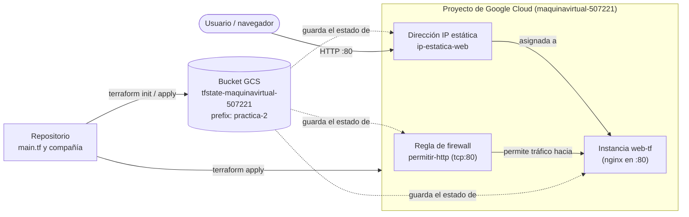

# Terraform

## Qué se construyó

Con este código de Terraform se despliega, en el proyecto de Google Cloud `maquinavirtual-507221`, una máquina virtual (`web-tf`) que sirve una página con `nginx` instalado por un script de arranque, protegida por una regla de firewall que solo abre el puerto 80. El estado de Terraform se guarda de forma remota en un bucket de GCS en vez de quedarse en el disco local, y como reto adicional la máquina usa una dirección IP externa estática (en vez de una efímera) para que la IP no cambie aunque se reinicie la VM o se le cambie el tipo de máquina.



## Evidencias

### Fase 1 — Escribir y aplicar

`terraform plan` y `terraform apply` crean la regla de firewall y la instancia:

```bash
mariafernandacoca@cloudshell:~/Terraform (maquinavirtual-507221)$ terraform plan

Terraform used the selected providers to generate the following execution plan. Resource actions are indicated with the following
symbols:
  + create

Terraform will perform the following actions:

  # google_compute_firewall.permitir_http will be created
  + resource "google_compute_firewall" "permitir_http" {
      + name               = "permitir-http"
      + network            = "default"
      + project            = "maquinavirtual-507221"
      + source_ranges      = [
          + "0.0.0.0/0",
        ]
      + target_tags        = [
          + "servidor-web",
        ]

      + allow {
          + ports    = [
              + "80",
            ]
          + protocol = "tcp"
        }
    }

  # google_compute_instance.web will be created
  + resource "google_compute_instance" "web" {
      + machine_type            = "e2-micro"
      + metadata_startup_script = <<-EOT
            #!/bin/bash
            apt update && apt install -y nginx
            echo "<h1><identificacion></h1><p>Servida desde Terraform por $(hostname)</p>" > /var/www/html/index.html
        EOT
      + name                    = "web-tf"
      + project                 = "maquinavirtual-507221"
      + tags                    = [
          + "servidor-web",
        ]
      + zone                    = "us-central1-a"

      + boot_disk {
          + initialize_params {
              + image = "debian-cloud/debian-12"
            }
        }

      + network_interface {
          + network = "default"
          + access_config {
              + nat_ip       = (known after apply)
              + network_tier = (known after apply)
            }
        }
    }

Plan: 2 to add, 0 to change, 0 to destroy.

mariafernandacoca@cloudshell:~/Terraform (maquinavirtual-507221)$ terraform apply
...
Do you want to perform these actions?
  Enter a value: yes

google_compute_firewall.permitir_http: Creating...
google_compute_instance.web: Creating...
google_compute_firewall.permitir_http: Creation complete after 11s [id=projects/maquinavirtual-507221/global/firewalls/permitir-http]
google_compute_instance.web: Creation complete after 17s [id=projects/maquinavirtual-507221/zones/us-central1-a/instances/web-tf]

Apply complete! Resources: 2 added, 0 changed, 0 destroyed.

mariafernandacoca@cloudshell:~/Terraform (maquinavirtual-507221)$ git status
On branch main
Your branch is up to date with 'origin/main'.

Untracked files:
  (use "git add <file>..." to include in what will be committed)
        .terraform.lock.hcl
        terraform_1.5.7_linux_amd64.zip

nothing added to commit but untracked files present (use "git add" to track)
```

### Fase 2 — Salida y comprobacion

```bash
mariafernandacoca@cloudshell:~/Terraform (maquinavirtual-507221)$ terraform output ip_externa
"136.114.113.250"

mariafernandacoca@cloudshell:~/Terraform (maquinavirtual-507221)$ curl -m 8 http://$(terraform output -raw ip_externa)
<h1><Grupo 6></h1><p>Servida desde Terraform por web-tf</p>
```

### Fase 3 — Idempotencia y deriva

Se comprueba que la infraestructura sigue igual a la configuración, luego se modifica manualmente un tag desde fuera de Terraform (por consola/`gcloud`) y `terraform plan` detecta la deriva:

```bash
mariafernandacoca@cloudshell:~/Terraform (maquinavirtual-507221)$ terraform apply
google_compute_firewall.permitir_http: Refreshing state... [id=projects/maquinavirtual-507221/global/firewalls/permitir-http]
google_compute_instance.web: Refreshing state... [id=projects/maquinavirtual-507221/zones/us-central1-a/instances/web-tf]

No changes. Your infrastructure matches the configuration.

Apply complete! Resources: 0 added, 0 changed, 0 destroyed.

Outputs:

ip_externa = "136.114.113.250"

mariafernandacoca@cloudshell:~/Terraform (maquinavirtual-507221)$ terraform plan
google_compute_firewall.permitir_http: Refreshing state... [id=projects/maquinavirtual-507221/global/firewalls/permitir-http]
google_compute_instance.web: Refreshing state... [id=projects/maquinavirtual-507221/zones/us-central1-a/instances/web-tf]

Terraform will perform the following actions:

  # google_compute_instance.web will be updated in-place
  ~ resource "google_compute_instance" "web" {
        id                      = "projects/maquinavirtual-507221/zones/us-central1-a/instances/web-tf"
        name                    = "web-tf"
      ~ tags                    = [
          - "prueba-manual",
            "servidor-web",
        ]
        # (21 unchanged attributes hidden)
        # (4 unchanged blocks hidden)
    }

Plan: 0 to add, 1 to change, 0 to destroy.

mariafernandacoca@cloudshell:~/Terraform (maquinavirtual-507221)$ gcloud compute instances describe web-tf --format="value(tags.items)" --zone=us-central1-a
servidor-web
```

### Fase 4 — Variables y cambio de tipo

El primer intento falla porque Google exige detener la instancia para cambiar el `machine_type`; se corrige agregando `allow_stopping_for_update = true` en `main.tf`:

```bash
mariafernandacoca@cloudshell:~/Terraform (maquinavirtual-507221)$ terraform apply -var tipo_maquina=e2-small
...
google_compute_instance.web: Modifying... [id=projects/maquinavirtual-507221/zones/us-central1-a/instances/web-tf]
╷
│ Error: Changing the machine_type, min_cpu_platform, service_account, enable_display, shielded_instance_config,
│ scheduling.node_affinities, scheduling.max_run_duration or network_interface.[#d].(network/subnetwork/subnetwork_project) or
│ advanced_machine_features on a started instance requires stopping it. To acknowledge this, please set
│ allow_stopping_for_update = true in your config.
│
│   with google_compute_instance.web,
│   on main.tf line 29, in resource "google_compute_instance" "web":
│   29: resource "google_compute_instance" "web" {

mariafernandacoca@cloudshell:~/Terraform (maquinavirtual-507221)$ terraform apply -var tipo_maquina=e2-small
...
  ~ resource "google_compute_instance" "web" {
        id                        = "projects/maquinavirtual-507221/zones/us-central1-a/instances/web-tf"
      ~ machine_type              = "e2-micro" -> "e2-small"
        name                      = "web-tf"
        # (21 unchanged attributes hidden)
        # (4 unchanged blocks hidden)
    }

Plan: 0 to add, 1 to change, 0 to destroy.

  Enter a value: yes

google_compute_instance.web: Modifying... [id=projects/maquinavirtual-507221/zones/us-central1-a/instances/web-tf]
google_compute_instance.web: Modifications complete after 36s [id=projects/maquinavirtual-507221/zones/us-central1-a/instances/web-tf]

Apply complete! Resources: 0 added, 1 changed, 0 destroyed.

Outputs:

ip_externa = "136.114.113.250"
```

### Fase 5 — Destruir y volver a crear

```bash
mariafernandacoca@cloudshell:~/Terraform (maquinavirtual-507221)$ time terraform destroy -auto-approve
google_compute_firewall.permitir_http: Refreshing state... [id=projects/maquinavirtual-507221/global/firewalls/permitir-http]
google_compute_instance.web: Refreshing state... [id=projects/maquinavirtual-507221/zones/us-central1-a/instances/web-tf]

Plan: 0 to add, 0 to change, 2 to destroy.

Changes to Outputs:
  - ip_externa = "104.154.132.55" -> null

google_compute_firewall.permitir_http: Destroying... [id=projects/maquinavirtual-507221/global/firewalls/permitir-http]
google_compute_instance.web: Destroying... [id=projects/maquinavirtual-507221/zones/us-central1-a/instances/web-tf]
google_compute_firewall.permitir_http: Destruction complete after 12s
google_compute_instance.web: Destruction complete after 22s

Destroy complete! Resources: 2 destroyed.

real    0m26.772s
user    0m6.808s
sys     0m0.802s
```

| Método | Tiempo |
|---|---|
| Interfaz gráfica (Práctica 1, fase 1) | Tiempo estimado de 3 minutos |
| `gcloud` (Práctica 1, fase 5) | Tiempo real 0m14.773s |
| Terraform (hoy) | Tiempo real 0m4.427s |


### Fase 6 — Estado remoto 

Se agrega el bloque `backend "gcs"` en `main.tf` (bucket `tfstate-maquinavirtual-507221`, prefijo `practica-2`) para que el `.tfstate` deje de vivir solo en el disco local:

```bash
mariafernandacoca@cloudshell:~/Terraform (maquinavirtual-507221)$ gcloud storage ls gs://tfstate-maquinavirtual-507221/**
gs://tfstate-maquinavirtual-507221/practica-2/default.tfstate
```

### Fase 7 — Dejar el proyecto limpio

Con la infraestructura ya destruida (fase 5) y el backend remoto recién inicializado (fase 6), se confirma que no queda ningún recurso huérfano generando costo, y se revisa el informe de facturación del proyecto:

```bash
mariafernandacoca@cloudshell:~/Terraform (maquinavirtual-507221)$ terraform state list
mariafernandacoca@cloudshell:~/Terraform (maquinavirtual-507221)$ gcloud compute instances list
Listed 0 items.
mariafernandacoca@cloudshell:~/Terraform (maquinavirtual-507221)$ gcloud compute disks list
Listed 0 items.
mariafernandacoca@cloudshell:~/Terraform (maquinavirtual-507221)$ gcloud compute addresses list
Listed 0 items.
mariafernandacoca@cloudshell:~/Terraform (maquinavirtual-507221)$ gcloud compute firewall-rules list --filter="name=permitir-http"

mariafernandacoca@cloudshell:~/Terraform (maquinavirtual-507221)$ git log --oneline
4168dd0 (HEAD -> main, origin/main, origin/HEAD) docs: Reto
174678d fix: ID
4d61775 feat: IP estatica
f2db1ef docs: Evidencia 6(state list)
b55abde fix: correcion eror main
3913a97 feat: destino del estado bucket
afbd1d5 docs: Evidencia5(real de time y tabla tiempos)
c72b416 docs: Evidencia 4(error y correccion de error)
a425efc fix: autorizacion al recurso
72f1306 feat: variables y cambio de tipo
6ac0043 docs: Evidencia 3(apply, deriva y describe)
f43ebcd docs: Evidencia 2 (ip_externa y curl)
bdf44a4 feat: Agregar identificador
deda51b feat: agregar output ip_externa
6a1d517 docs: Evidencia 1 (plan, apply, git status)
12068ed feat: Config de Terraform para VM y firewall en GCP
61181f2 Initial commit
```

### Reto — IP externa estática

Se agrega el recurso `google_compute_address` y se hace que la instancia use `nat_ip = google_compute_address.ip_estatica.address` en vez de una IP efímera. El primer intento de `apply` falla porque `terraform.tfvars` tenía un placeholder (`<ID-DEL-PROYECTO>`) sin reemplazar por el proyecto real:

```bash
mariafernandacoca@cloudshell:~/Terraform (maquinavirtual-507221)$ terraform plan

  # google_compute_address.ip_estatica will be created
  + resource "google_compute_address" "ip_estatica" {
      + name    = "ip-estatica-web"
      + project = "<ID-DEL-PROYECTO>"
    }

  # google_compute_firewall.permitir_http will be created
  + resource "google_compute_firewall" "permitir_http" {
      + name    = "permitir-http"
      + project = "<ID-DEL-PROYECTO>"
    }

  # google_compute_instance.web will be created
  + resource "google_compute_instance" "web" {
      + name    = "web-tf"
      + project = "<ID-DEL-PROYECTO>"
    }

Plan: 3 to add, 0 to change, 0 to destroy.

mariafernandacoca@cloudshell:~/Terraform (maquinavirtual-507221)$ terraform output ip_externa
╷
│ Warning: No outputs found
```

Tras corregir `terraform.tfvars` con el ID real del proyecto (`maquinavirtual-507221`), el `apply` crea los tres recursos y la instancia queda con la IP estática:

```bash
Apply complete! Resources: 3 added, 0 changed, 0 destroyed.

Outputs:

ip_externa = "34.66.85.72"
```

Por último, se cambia otra vez el tipo de máquina con `-var` para demostrar que, al usar una IP estática, esta ya no cambia aunque la VM se reinicie:

```bash
terraform apply -var="tipo_maquina=e2-small"
terraform output ip_externa
```

## Preguntas

**1. En la fase 3, la etiqueta puesta a mano desapareció con el siguiente apply. Si en lugar de una etiqueta se hubiera creado a mano una máquina nueva, web-manual, ¿qué habría propuesto terraform plan? ¿Y qué habría hecho terraform destroy con ella? Justificar con el papel que cumple el estado.**

Con la etiqueta, `terraform plan` la detectó porque el tag es un atributo de un recurso que Terraform *ya tiene en su estado* (`google_compute_instance.web`): al refrescar, comparó el valor real contra el declarado en `main.tf` y propuso corregirlo. Una máquina nueva creada a mano (`web-manual`) haria que Terraform no inspeccione todo el proyecto de Google Cloud buscando cosas que no reconoce, solo compara lo que está en `terraform.tfstate` contra la configuración. Como `web-manual` nunca se creó con `apply` ni se trajo con `terraform import`, no existe en el estado, así que:

- `terraform plan` no habría mostrado ningún cambio relacionado con ella — ni para crearla, cambiarla ni mucho menos "detectarla". 
- `terraform destroy` tampoco la habría tocado, porque destroy solo borra lo que aparece en el estado. 

**2. El bucket del estado se creó con gcloud y no en main.tf. Explicar el problema con palabras propias y decir qué pasaría el día que alguien ejecute terraform destroy si el bucket sí estuviera declarado ahí.**

El bucket al especificarlo es necesario que pueda ser tomado desde `terraform init`, antes de poder gestionar cualquier recurso. No se pude dentro de la misma ejecucion que Terraform cree el bucket en donde se va a guardar el registro de esa misma ejecucion. Por eso es necesario crearlo manual, una sola vez y en `main.tf` solo lo referencia como backend.

Si se llegara a declarar el bucket dentro del main, cuando alguien ejecute terraform  destroy, Terraform intentaria borrar tambien el bucket, pero ese bucket contiene el archivo de estado que Terraform esta leyendo en ese preciso momento para saber que ir destruyendo. 

**3. Con los precios de lista de la calculadora de Google Cloud: ¿cuánto costaría un mes con la infraestructura de la fase 6 encendida? ¿Cuánto costó tenerla encendida durante la práctica? ¿Qué recurso sigue costando después del destroy, cuánto, y por qué se decidió conservarlo?**

| Recurso | Precio de lista | Costo mensual (730 h) |
|---|---|---|
| VM `e2-micro` (us-central1) | ≈ USD 0.0084/h | ≈ USD 6.11 |
| Disco `pd-standard` 10 GB | USD 0.04/GB-mes | ≈ USD 0.40 |
| IP externa (en uso, adjunta a la VM) | USD 0.005/h | ≈ USD 3.65 |
| Regla de firewall | — | USD 0.00 |
| **Total (precio de lista)** | | **≈ USD 10.16/mes** |

Esto es precio de lista; en la práctica, Google Cloud incluye en su nivel siempre gratuito una VM `e2-micro` en `us-central1` con 30 GB de disco estándar al mes, así que si el proyecto calificara para ese nivel gratuito el costo real bajaría a prácticamente USD 0.

*Cuánto costó tenerla encendida durante la práctica:* según el informe real de facturación del proyecto (periodo 7–13 de septiembre de 2026, `evidencias/07/facturacion/facturacion.png`), Compute Engine cobró **$0**, y Networking generó **$302 (COP)** 

*Qué recurso sigue costando después del `destroy`:* el **bucket de GCS** (`tfstate-maquinavirtual-507221`) con el archivo de estado, porque nunca estuvo declarado como recurso de Terraform y por lo tanto `terraform destroy` se conservó a propósito, para no perder el historial del estado remoto entre una práctica y la siguiente. 
